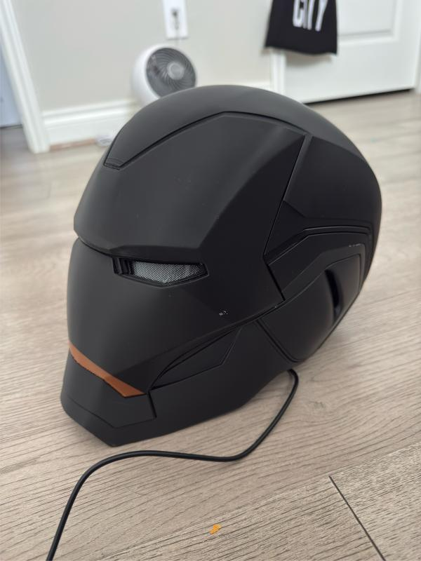
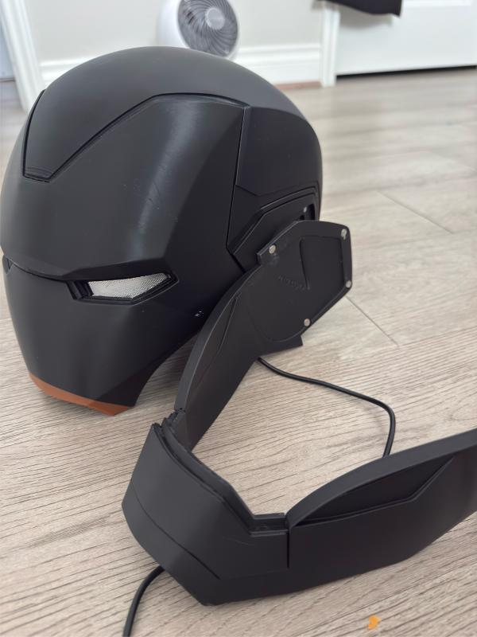
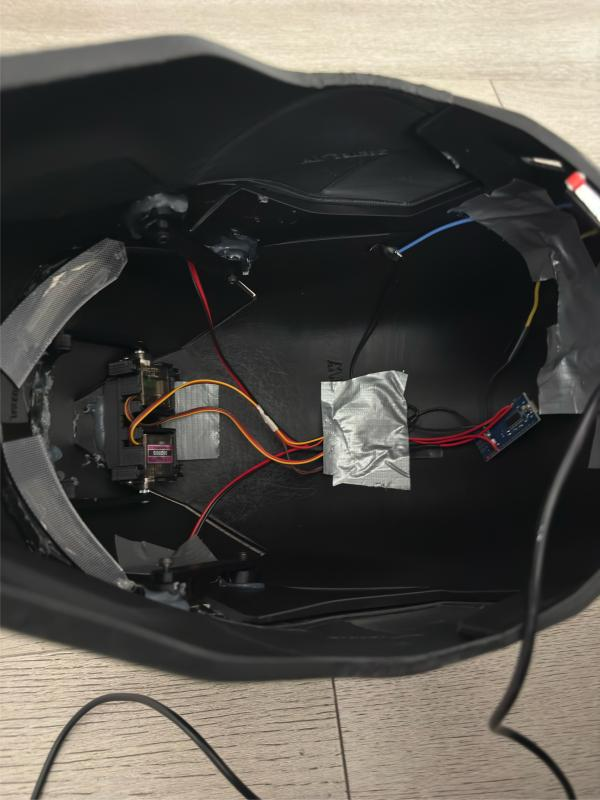

# Wearable Iron Man Helmet

## Overview

As part of a guided engineering project, I assembled and integrated a wearable Iron Man helmet featuring a motorized visor operated by an Arduino Nano and servo motor. The project focused on electromechanical integration, assembly, testing, and troubleshooting rather than designing the helmet from scratch.

---

## Project Objective

Assemble a functional wearable helmet with a motorized visor by integrating mechanical, electrical, and electronic components into a working system.

---

## My Responsibilities

- Assembled the helmet and mechanical components
- Wired the Arduino Nano, servo motor, and LEDs
- Installed and aligned the visor linkage mechanism
- Tested visor movement and servo operation
- Troubleshot wiring and mechanical alignment issues

---

## Components Used

- Arduino Nano
- Servo Motor
- 3D Printed Helmet
- 3D Printed Linkage Arms
- LEDs
- Electrical Wiring
- Battery Pack

---

## Engineering Concepts

- Mechanical Assembly
- Electromechanical Integration
- Servo Motion
- Arduino Hardware
- Electrical Wiring
- System Testing
- Troubleshooting

---

## Challenges

One of the biggest challenges was properly installing the support arms to move the mask up and down correctly and to ensure smooth visor movement. Multiple rounds of testing and adjustment were required to achieve reliable operation.

---

## Results

Successfully assembled and tested a wearable Iron Man helmet with a functioning motorized visor that consistently opened and closed using an Arduino-controlled servo mechanism.

---

## What I Learned

This project strengthened my understanding of:

- Mechanical assembly
- Arduino-based systems
- Servo motor operation
- Wiring and electronics integration
- Iterative testing and troubleshooting

---

## Gallery

### Full Helmet

### Helmet with Jaw Part Disconnected

### Inside the Helmet

